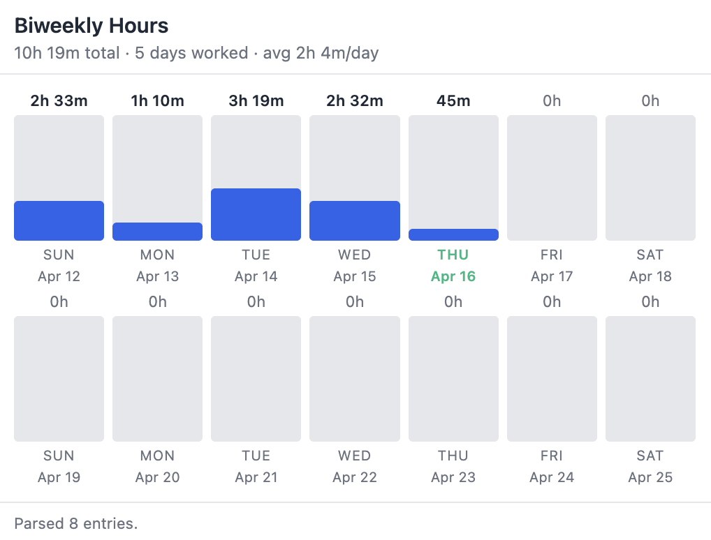

# JobX Timesheet Hours

A Chrome/Edge extension that reads your JobX timesheet and visualizes total hours per day in a 2-week bar graph. Useful for tracking how many hours you're logging across a pay period at a glance.

JobX is a student employment timesheet platform by NGWebSolutions, used by many universities.

- Sums logged hours per day from the timesheet table
- Renders a 14-day bar chart starting from the Sunday on-or-before your earliest entry
- Highlights the current day
- Shows a summary: total hours, days worked, average per worked day
- Works on any school's JobX instance
- Runs locally in the browser

## Screenshot

## Installation
Chrome Web Store
https://chromewebstore.google.com/detail/jobx-timesheet-hours/bihddccjfhaddcbeokhjhmaceahjieml?pli=1

Or from releases:
1. [Download](https://github.com/aiexr/jobX-time-extension/releases) the `extension` folder from this repository
2. Extract to a folder
3. Open `chrome://extensions` (or `edge://extensions`)
4. Enable **Developer mode** (top right toggle)
5. Click **Load unpacked** and select the folder containing the extension files
6. Enable the extension

## Usage
1. Open your JobX timesheet (URL contains `tsx_stumanagetimesheet.aspx`)
2. Click the extension icon in the toolbar
3. The popup shows a bar for each of the 14 days, with hours logged and a running total

## Compatibile with:
- Manifest V3
- Chrome, Edge, Brave, and other Chromium-based browsers
- Any JobX instance served from `*.studentemployment.ngwebsolutions.com`
